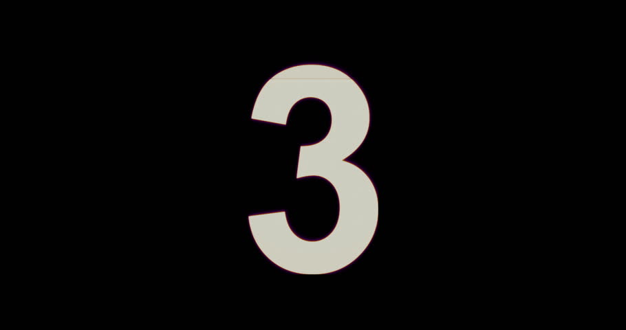
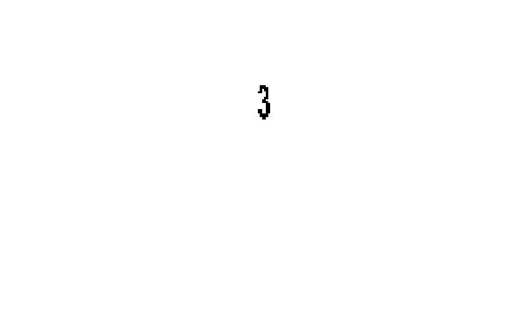

# Digit recognition with CNN
Built a numeric character recognition system trained on the MNIST dataset using __Convolutional Neural Networks__.

## Architecture
I used a simple architecture based on a very popular network called the [LeNet](http://ieeexplore.ieee.org/abstract/document/726791/):

__1.__ Input - 1×28×28

__2.__ Convolution - k = 5, s = 1, p = 0, 20 filters

__3.__ ReLU

__4.__ MAXPooling - k=2, s=2, p=0

__5.__ Convolution - k = 5, s = 1, p = 0, 50 filters

__6.__ ReLU

__7.__ MAXPooling - k=2, s=2, p=0

__8.__ Fully Connected layer - 500 neurons

__9.__ ReLU

__10.__ Loss layer - A softmax function is used to convert the output to a probability score

## Results

The original image given as an input to the system:

The image before being given to CNN forward pass as inout data:

The following shows the output for the __Loss Layer__ which represent the probability assigned to each number (from 0 to 9):

P = 0.0009 0.0000 0.0388 __0.8451__ 0.0000 0.0000 0.0000 0.0000 0.1152 0.0000

With 84.51% probability, this image was labelled correctly as a 3. 11.52% labelled wrong as an 8.
